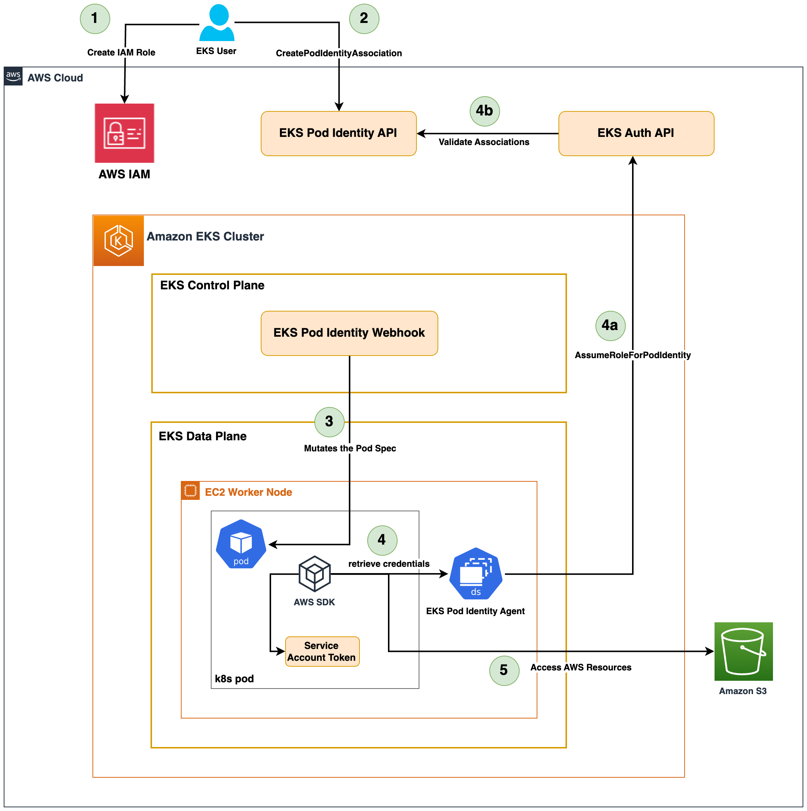

# Amazon EKS Pod Identity Demo

In this walkthrough, we will demonstrate how to use the new Amazon EKS Pod Identity feature to securely provide AWS access to kubernetes pods.

## Solution Architecture



## Pre-requisites

* An AWS Account
* export AWS_REGION=ap-southeast-1 # Replace with your AWS region
* export CLUSTER_NAME=eks-pod-identity-demo-4 # Replace with your cluster name
* export AWS_ACCOUNT=123456789012 # Your AWS Account number
* [AWS CLI](https://aws.amazon.com/cli/) and credentails from both AWS Accounts, alternatively use [AWS CloudShell](https://docs.aws.amazon.com/cloudshell/latest/userguide/welcome.html#how-to-get-started)
* [eksctl](https://eksctl.io/) - a simple CLI tool for creating and managing Amazon EKS clusters
* [git](https://github.com/git-guides/install-git)
  ```shell
    git clone https://github.com/mrnonz/demo-aws-summit-bangkok-2024
    cd demo-aws-summit-bangkok-2024/eks-pod-identity
  ```

## Setup

Lets start by creating an Amazon EKS Cluster using eksctl with the new eks-pod-identity-agent addon.

```shell
eksctl create cluster -f cluster.yaml
```

Wait for cluster creation to be complete and verify if eks-pod-identity-agent addon is running on the cluster and the worker nodes.

```shell
aws eks describe-addon --cluster-name ${CLUSTER_NAME} --region ${AWS_REGION} --addon-name eks-pod-identity-agent
```
```json
{
    "addon": {
        "addonName": "eks-pod-identity-agent",
        "clusterName": "eks-pod-identity-demo-4",
        "status": "ACTIVE",
        "addonVersion": "v1.2.0-eksbuild.1",
        "health": {
            "issues": []
        },
        "addonArn": "arn:aws:eks:ap-southeast-1:{AWS_ACCOUNT}:addon/eks-pod-identity-demo-4/eks-pod-identity-agent/bac7d9f1-52cf-26ab-a77e-9e0820feb8e2",
        "createdAt": "2024-05-26T14:52:06.591000+07:00",
        "modifiedAt": "2024-05-26T14:52:43.300000+07:00",
        "tags": {}
    }
}
```

```shell
kubectl get pods -n kube-system --selector app.kubernetes.io/name=eks-pod-identity-agent
```
```output
NAME                           READY   STATUS    RESTARTS   AGE
eks-pod-identity-agent-5d6cb   1/1     Running   0          2m11s
eks-pod-identity-agent-69thw   1/1     Running   0          2m11s
```
Deploy a sample python flask application that utilizes IAM credentials to access Amazon S3 buckets. We will use EKS Pod Identity feature to associate an IAM role to the kubernetes service account assigned to the deployment. Lets start by creating an IAM role with S3 readonly policy.

```shell
export POD_ROLE_ARN=$(aws iam create-role --role-name s3-app-eks-pod-identity-role \
 --assume-role-policy-document file://eks-pod-identity-trust-policy.json \
 --output text --query 'Role.Arn')

aws iam attach-role-policy --role-name s3-app-eks-pod-identity-role --policy-arn arn:aws:iam::aws:policy/AmazonS3ReadOnlyAccess
```

Now, associate the IAM role with the EKS Pod Identity by calling create-pod-identity-association.

```shell
aws eks create-pod-identity-association \
--cluster-name $CLUSTER_NAME \
--namespace s3-app-ns \
--service-account s3-app-sa \
--role-arn $POD_ROLE_ARN \
--region $AWS_REGION
```

Lets deploy a sample python flask application that utilizes boto3 sdk to interact with Amazon S3 resources. This is deployed in s3-app-ns namespace and with s3-app-sa service account.

```shell
kubectl apply -f s3-app.yaml
```
```output
namespace/s3-app-ns created
serviceaccount/s3-app-sa created
deployment.apps/s3-app-deployment created
service/s3-app-svc created
```
Wait for the pods and LoadBalancer service to become ready and fetch the LoadBalancer url using the below command:

```shell
kubectl get all -n s3-app-ns
```
```output
NAME                                    READY   STATUS    RESTARTS   AGE
pod/s3-app-deployment-66cc64db6-5sd6w   1/1     Running   0          29s
pod/s3-app-deployment-66cc64db6-bzkn4   1/1     Running   0          29s

NAME                 TYPE           CLUSTER-IP       EXTERNAL-IP                                                                          PORT(S)        AGE
service/s3-app-svc   LoadBalancer   10.100.145.185   a2b4e7aa367364b1784e8c01516c71f7-0d795b546356916a.elb.ap-southeast-1.amazonaws.com   80:30775/TCP   29s

NAME                                READY   UP-TO-DATE   AVAILABLE   AGE
deployment.apps/s3-app-deployment   2/2     2            2           29s

NAME                                          DESIRED   CURRENT   READY   AGE
replicaset.apps/s3-app-deployment-66cc64db6   2         2         2       29s
```

```shell
export LB_URL=$(kubectl get svc -n s3-app-ns s3-app-svc -o jsonpath='{.status.loadBalancer.ingress[0].hostname}')
```
```output
curl http://$LB_URL/list-buckets
[LIST OF BUCKETS]
```

This demonstrates how the EKS workloads can utilize the new EKS Pod Identity feature to securely access other AWS resources using the temporary IAM credentials.


## Clean up

```shell
eksctl delete cluster -f cluster.yaml
```
